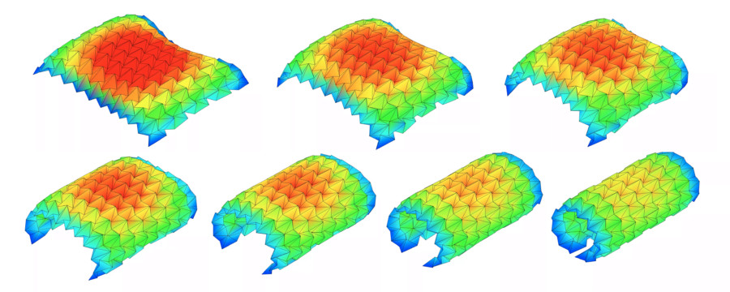

# OrigamiSimulator for Curved Folding
This software is developed based on [OrigamiSimulator](https://github.com/amandaghassaei/OrigamiSimulator).

## Usage
It is basically the same as the OrigamiSimulator. When you input a crease pattern that includes curved folds, you must do the following three things in addition to the instructions in the OrigamiSimulator to create a crease pattern.
- Replace curves in a crease pattern with polylines.
- Split the boundary lines in a crease pattern.

The above two tasks can be done in Adobe Illustrator with [flatten.jsx](https://github.com/shspage/illustrator-scripts/blob/master/flatten.jsx) in [shspage/illustrator-scripts](https://github.com/shspage/illustrator-scripts). Select mid_t as the division method. For a 150 mm square boundary line, max error and max distance between 2 points are recommended to be 20 pts and 0.2 pt, respectively.
- Set the color of mountain curved fold lines to RGB(200,0,0,0) and the the color of valley curved fold lines to RGB(0,0,200).

## References
- [OrigamiSimulator](https://github.com/amandaghassaei/OrigamiSimulator)
- [cdt2d](https://github.com/mikolalysenko/cdt2d)

Licenses are in LICENSES.txt.

The followings are the same instruction in Japanese and the README of the OrigamiSimulator.

# OrigamiSimulator for Curved Folding
このソフトウェアは [OrigamiSimulator](https://github.com/amandaghassaei/OrigamiSimulator) を基に作成されています。

## 使い方
基本的には OrigamiSimulator と同じです。曲線折りを含む展開図を入力する場合には OrigamiSimulator 内で説明されている展開図作成方法に加えて以下の3つの作業をしてください。
- 展開図中の曲線を polyline に置き換える
- 展開図中の輪郭線を分割する

上記2つの作業は、Adobe Illustrator で [shspage/illustrator-scripts](https://github.com/shspage/illustrator-scripts) の [flatten.jsx](https://github.com/shspage/illustrator-scripts/blob/master/flatten.jsx) を使用するとまとめて簡単にできます。分割方法は mid_t を選択してください。パラメータの目安は、150mm四方の輪郭線の場合で max error が 0.2 pt、max distance between 2 points が 20pt です。
- 曲線の山折り線の色を RGB(200,0,0) に、曲線の谷折り線を RGB(0,0,200) に設定する

## 使用したもの
- [OrigamiSimulator](https://github.com/amandaghassaei/OrigamiSimulator)
- [cdt2d](https://github.com/mikolalysenko/cdt2d)

ライセンスはLICENSES.txtに記載しています。

ここから先は OrigamiSimulator の README です。

# README of OrigamiSimulator

Live demo at <a href="http://apps.amandaghassaei.com/OrigamiSimulator">apps.amandaghassaei.com/OrigamiSimulator</a> 

This app allows you to simulate how any origami crease pattern will fold.  It may look a little different
from what you typically think of as "origami" - rather than folding paper in a set of sequential steps,
this simulation attempts to fold every crease simultaneously. It does this by iteratively solving for small displacements in the geometry of an initially flat sheet due to forces
exerted by creases.  This solver extends work from the following sources:   
&nbsp;&nbsp;&nbsp;&nbsp;<a target="_blank" href="http://www2.eng.cam.ac.uk/~sdg/preprint/5OSME.pdf">Origami Folding: A Structural Engineering Approach</a> by Mark Schenk and Simon D. Guest 
&nbsp;&nbsp;&nbsp;&nbsp;<a target="_blank" href="http://www.tsg.ne.jp/TT/cg/TachiFreeformOrigami2010.pdf">Freeform Variations of Origami</a> by Tomohiro Tachi 
 
All simulation methods were written from scratch and are executed in parallel in several GPU fragment shaders for fast performance.

 Origami Simulator for Curved Folding
<b>Instructions:</b>  
 
<ul>
    <li>Slide the <b>Fold Percent</b> slider to control the degree of folding of the pattern (100% is fully folded, 0% is unfolded,
        and -100% is fully folded with the opposite mountain/valley assignments).</li>
    <li>Drag to rotate the model, scroll to zoom.</li>
    <li>Import other patterns under the <b>Examples</b> menu.</li>
    <li>Upload your own crease patterns in SVG or <a href="https://github.com/edemaine/fold" target="_blank">FOLD</a> formats, following the instructions under <b>File > File Import Tips</b>.</li>
    <li>Export FOLD files or 3D models ( STL or OBJ ) of the folded state of your design ( <b>File > Save Simulation as...</b> ).</li>
    </ul>
        
    <ul>
    <li>Visualize the internal strain of the origami as it folds using the <b>Strain Visualization</b> in the left menu.</li>
    </ul>
         
    <ul>
    <li>If you are working from a computer connected to a Vive, follow the instructions near the <b>VR</b> menu
        to use this app in an interactive virtual reality mode.</li>
</ul>

 

<b>External Libraries:</b>  
<ul>
    <li>All rendering and 3D interaction done with <a target="_blank" href="https://threejs.org/">three.js</a></li>
    <li><a href="https://www.npmjs.com/package/path-data-polyfill" target="_blank">path-data-polyfill</a> helps with SVG path parsing</li>
    <li><a href="https://github.com/edemaine/fold" target="_blank">FOLD</a> is used as the internal data structure, methods from the
        <a href="https://github.com/edemaine/fold/blob/master/doc/api.md" target="_blank">FOLD API</a> used for SVG parsing</li>
    <li>Arbitrary polygonal faces of imported geometry are triangulated using the <a target="_blank" href="https://github.com/mapbox/earcut">Earcut Library</a></li>
    <li>GIF and WebM video export uses <a target="_blank" href="https://github.com/spite/ccapture.js/">CCapture</a></li>
    <li>Portability to multiple VR controllers by <a target="_blank" href="https://github.com/stewdio/THREE.VRController">THREE.VRController.js</a></li>
    <li>VR GUI by <a href="https://github.com/dataarts/dat.guiVR" target="_blank">dat.guiVR</a></li>
    <li><a href="http://www.numericjs.com/" target="_blank">numeric.js</a> for linear algebra operations</li>
    <li><a href="https://github.com/eligrey/FileSaver.js/" target="_blank">FileSaver</a> for client-side file saving</li>
    <li><a target="_blank" href="https://jquery.com/">jQuery</a>, <a target="_blank" href="http://getbootstrap.com/">Bootstrap</a>, and the
        <a target="_blank" href="http://designmodo.github.io/Flat-UI/">Flat UI theme</a> used to build the GUI</li>
</ul>

 
Built by <a href="http://www.amandaghassaei.com/" target="_blank">Amanda Ghassaei</a> as a final project for <a href="http://courses.csail.mit.edu/6.849/spring17/" target="_blank">Geometric Folding Algorithms</a>.
Code available on <a href="https://github.com/amandaghassaei/OrigamiSimulator" target="_blank">Github</a>.  If you have interesting crease patterns that would
make good demo files, please send them to me (Amanda) so I can add them to the <b>Examples</b> menu.  My email address is on my website.  Thanks! 
 
More documentation coming soon - I'm preparing a paper about the simulation methods used here, I will post it once its ready.
                    For now, find some additional info <a href="http://www.amandaghassaei.com/projects/origami_simulator/" target="_blank">here</a>. 